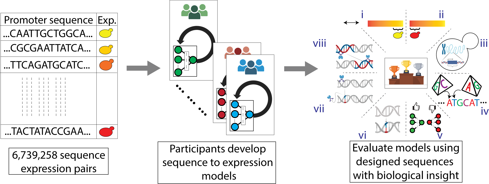

# Random Promoter Dream Challenge 2022

To address the lack of standardized evaluation and continual improvement of genomics models, we organized the [Random Promoter DREAM Challenge 2022](https://www.synapse.org/#!Synapse:syn28469146/wiki/617075). Here, we asked the participants to design sequence-to-expression models and train them on expression measurements of random promoter sequences. The models would receive regulatory DNA sequence as input and use it to predict the corresponding gene expression value. We designed a separate set of sequences to test the limits of the models and provide insight into model performance.

The top-performing solutions in the challenge exceeded performance of all previous state-of-the-art models for similar data. The top-performing models included features inspired by the nature of the experiment and the state-of-the-art models from computer vision and NLP, while incorporating novel training strategies that are better suited to genomics sequence data. To determine how individual design choices affect performance, we created a Prix Fixe framework that enables modular testing of individual model components, revealing further performance gains.

Finally, we benchmarked the DREAM models on Drosophila and human datasets, including predicting expression and open chromatin from DNA sequence, where they consistently surpassed existing state-of-the-art performances. Overall, we demonstrate that high-quality gold-standard genomics datasets can drive significant progress in model development.

## Resources

More details about the findings of the consortium are available in [biorxiv](https://www.biorxiv.org/content/10.1101/2023.04.26.538471v2). The raw and processed data are available in [GEO](https://www.ncbi.nlm.nih.gov/geo/query/acc.cgi?acc=GSE254493) and [Zenodo](https://zenodo.org/records/10633252), respectively. All submissions (code+report) made at the end of DREAM Challenge are available [here](https://github.com/de-Boer-Lab/random-promoter-dream-challenge-2022/tree/main/dream_submissions).

## Setting Up Your Environment

The `environment.yml` file specifies all required libraries for this project. If you're managing virtual environments with Anaconda, you can directly install these dependencies using the command:

`conda env create -n dream -f environment.yml`

## Prix Fixe Framework

Details regarding the Prix Fixe framework is presented [here](https://github.com/de-Boer-Lab/random-promoter-dream-challenge-2022/blob/main/prixfixe/readme.MD).
For a comprehensive example of setting up and running a complete pipeline of the DREAM-optimized models using the Prix Fixe framework, refer to [this tutorial](https://github.com/de-Boer-Lab/random-promoter-dream-challenge-2022/blob/main/DREAMNets_BuildModel_Train_and_Predict.ipynb).

To convert your own model architectures within the prixfixe framework, refer to [this tutorial](https://github.com/de-Boer-Lab/random-promoter-dream-challenge-2022/blob/main/Test_Your_NN_In_Prix_Fixe.ipynb), which contains `ResNet` implementation example.

## Applying the Prix Fixe Framework

### Benchmarking new architectures

You can use the prixfixe framework to benchmark your model architecture on the DREAM Challenge dataset. All the DREAM-optimized models share the same training strategy, even some network components like first layers block and final layers block (more details on the paper). You can use them and focus on designing your core architecture block. You can also attempt to design better first layer blocks and final layer blocks that further improve the performance of the DREAM-optimized models.

### Directly applying the DREAM-optimized models to your data

You can directly train the DREAM-optimized models on your MPRA/STARR-seq data by following these tutorials.  
[[single-task]](https://github.com/de-Boer-Lab/random-promoter-dream-challenge-2022/blob/main/benchmarks/human/DREAMNets_buildModel_Train_Predict.ipynb) [[multi-task]](https://github.com/de-Boer-Lab/random-promoter-dream-challenge-2022/blob/main/benchmarks/drosophila/DREAMNets_buildModel_Train_Predict.ipynb)

## Contributions

If you wish to add new models components to [prixfixe](https://github.com/de-Boer-Lab/random-promoter-dream-challenge-2022/blob/main/prixfixe/readme.MD) that further improve the performance of DREAM-optimized models, please follow the standard GitHub pull request process.   You can also contribute by converting the DREAM [submissions](https://github.com/de-Boer-Lab/random-promoter-dream-challenge-2022/tree/main/dream_submissions) into the prixfixe framework and reporting their performance. Please use GitHub issues to let us know if you want to work on a particular model so we can coordinate. 