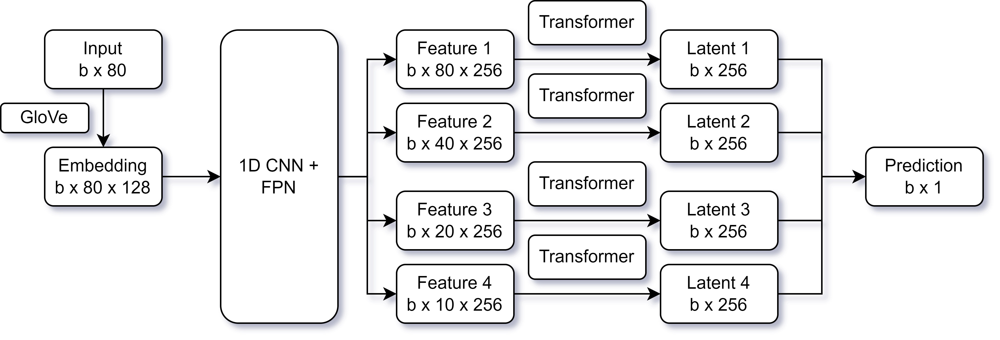

# DREAM Challenge 2022: Predicting gene expression using millions of random promoter sequences by NAD
## Abstract
To predict the gene expression from the promoter sequences, we develop a pipeline including two stages: (i) generating the embedding vectors for each base position using GloVe, and (ii) using the embedding vectors as input of neural networks to predict the gene expression level. Our neural network model is a combination of convolutional neural network for feature extraction, and transformer for prediction.

## Description of data usage
We first filter the training data and only keep the sequences that have length of 80 and contain no Ns. We use 90% of the data for training, and 10% for validation and selecting the best model.

For each base of the sequence, we consider the 5-base group (from i-2 to i+2 of base i) as the word represented that position. For example, for the sequence AA(TTCC)GG, the (TTCC) part will become AATTC ATTCC TTCCG TCCGG. We consider each sequence of 80 bases as a sentence and each base as a word. We use [GloVe](https://nlp.stanford.edu/projects/glove/) to generate the 128 feature embedding vector for each word using all the sequences in the training set. Finally, each sequence is represented as a matrix of 80*128.  

For the labels of the sequences, we transform the labels to range from 0 to 1 using these steps: (i) the labels in range [0-8] are converted to range [5-8], (ii) all the labels are subtracted by 5 (become [0-12]), and (iii) the labels are divided by 12 (become [0-1]). During the training step, we add gaussian noise with mean 0 and standard deviation 0.05 to the labels.

## Description of the model
In our model, we first use 1D convolutional neural network and feature pyramid network to extract the features from the sequence at different levels. We then apply transformer to each feature level to generate the prediction. The final prediction is the average of the prediction at each level. The model is described in the following figure.



## Training procedure
We use AdamW optimizer with learning rate of 2e-4, and weight decay of 5e-2 to train the model. We also apply [GSAM](https://openreview.net/pdf?id=edONMAnhLu-) to the optimizer to improve the performance. We train the model for 50 epochs with linear decay of learning rate. Furthermore, we use smooth l1 loss with beta of 0.1 to train the model. The smooth l1 loss is used to force the model to focus more on the sequences with accurate predictions but still do not completely ignore the rest of the sequences. The Pearson correlation of the validation set is 0.765. 

To replicate the result, `Step1.sh` script is used to generate the embedding vectors for the words. The competition `train_sequences.txt` and `test_sequences.txt` files are necessary in the `data` folder. The `Step2.sh` script is used to train the model and generate predictions of test set. The optional `Step0.sh` script is used to install the necessary dependencies.

## Contributions
| Name       | Affiliation               | Email               |
|------------|---------------------------|---------------------|
| Duc Tran   | University of Nevada Reno | duct@nevada.unr.edu |
| Tin Nguyen | University of Nevada Reno | tinn@unr.edu        |

## References

```bibtex
@inproceedings{pennington2014glove,
  title={Glove: Global vectors for word representation},
  author={Pennington, Jeffrey and Socher, Richard and Manning, Christopher D},
  booktitle={Proceedings of the 2014 conference on empirical methods in natural language processing (EMNLP)},
  pages={1532--1543},
  year={2014}
}
@article{zhuang2022surrogate,
  title={Surrogate gap minimization improves sharpness-aware training},
  author={Zhuang, Juntang and Gong, Boqing and Yuan, Liangzhe and Cui, Yin and Adam, Hartwig and Dvornek, Nicha and Tatikonda, Sekhar and Duncan, James and Liu, Ting},
  journal={arXiv preprint arXiv:2203.08065},
  year={2022}
}
```