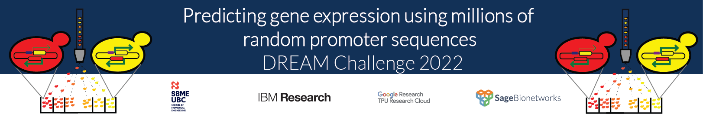

# DREAM Challenge 2022

## Predicting gene expression using millions of random promoter sequences by mt

Create a conda env using the environment.yml file. If the env creation fails, the python version and packages used are listed in the last cells of the jupyter notebook (250_pandas_final_1_bis_bc-0.745-Copy1.nbconvert.ipynb) 

The jupyter notebook contains an end-to-end strategy to predict the expression of genes using random promoters. Click <a href="https://drive.google.com/drive/folders/1aziagRaXilzBIo1VwjQDkXi9kDMovmDn?usp=sharing">here</a> to download the input files. If the input files and the notebook are present in the same folder, you can run all cells to train the model until epoch 11, used for the competition. The notebook will then produce the prediction on the test set in tsv format and json format.

Alternatively, you can directly use a helper function (make_prediction) to predict the test sequences with the sub_model.11.h5 model (used for the competition) or any other model created during training.

### Read more about this model <a href="Report_def.docx" >here </a>

